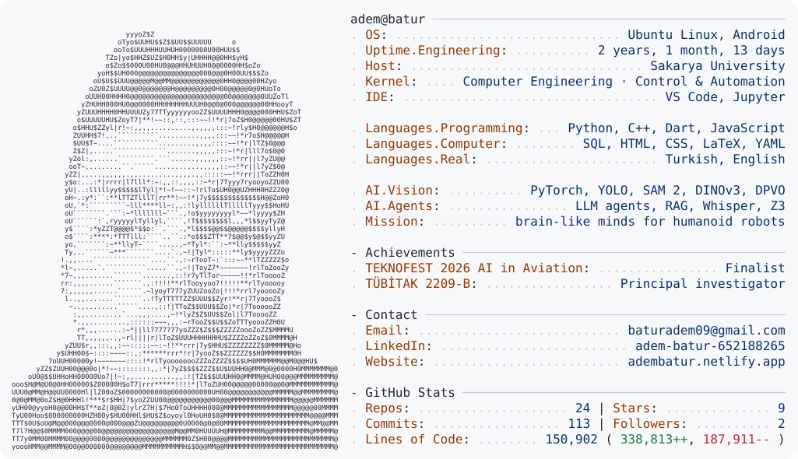

<a href="https://github.com/adembtr">
  <picture>
    <source media="(prefers-color-scheme: dark)" srcset="./dark_mode.svg">
    
  </picture>
</a>

The portrait is my photo redrawn in characters by <a href="ascii_portrait.py"><code>ascii_portrait.py</code></a> · the stats are rebuilt every day by <a href="today.py"><code>today.py</code></a> and GitHub Actions.

### Featured work

| Project | What it is | Highlights |
|---|---|---|
| [**nuron-teknofest-2026**](https://github.com/adembtr/nuron-teknofest-2026) | UAV perception and GPS-denied positioning on one frame stream | TEKNOFEST 2026 AI in Aviation finalist · single 8 GB GPU · detection + visual odometry + RGB/thermal matching |
| [**monocular-vo-drone-position**](https://github.com/adembtr/monocular-vo-drone-position) | 3D drone position from a single RGB camera, no GPS | DPVO visual odometry + Umeyama alignment |
| [**drone-reference-matching**](https://github.com/adembtr/drone-reference-matching) | Find a reference object across RGB and thermal drone video | DINOv3 masked embeddings + SAM 2 tracking |
| [**arc-agi3-agent**](https://github.com/adembtr/arc-agi3-agent) | From-scratch symbolic agent for ARC-AGI-3 — no LLM, no pretrained model | emergent shape/event tokens · Z3 MaxSAT rule learning |
| [**brain-edge-architecture**](https://github.com/adembtr/brain-edge-architecture) | Brain-inspired learning architecture for ARC-AGI-3: rules carry their own usage budget, so exploration emerges by itself | no LLM, no dataset · bisimulation · hypervectors |
| [**turkish-plate-ocr**](https://github.com/adembtr/turkish-plate-ocr) | Turkish licence-plate recognition | best of 3 OCR engines · ~455 plates/s on CPU |
| [**mathai**](https://github.com/adembtr/mathai) | A small transformer that learns arithmetic step by step | scratchpad reasoning · position coupling · curriculum |
| [**rag-pdf-qa**](https://github.com/adembtr/rag-pdf-qa) | Local multilingual RAG over your own PDF library | ChromaDB · page-level citations |
| [**arduino-servo-hand**](https://github.com/adembtr/arduino-servo-hand) | Four-finger servo-driven robotic hand — first hardware step towards humanoids | smooth interpolated pose transitions (early prototype) |
| [**whisper-phone-dictation**](https://github.com/adembtr/whisper-phone-dictation) | Phone as a wireless push-to-talk mic: local faster-whisper on Linux, typed into the focused window | fully local speech-to-text |

**Also:** [English-Tutor-Bot-](https://github.com/adembtr/English-Tutor-Bot-) and [myVideoGenerator](https://github.com/adembtr/myVideoGenerator) (n8n + LLM automations) ·
[VTYSPROJE](https://github.com/adembtr/VTYSPROJE) (PostgreSQL + Streamlit) · [veriyapilariProje](https://github.com/adembtr/veriyapilariProje) (C++ data structures) ·
web tools: [wordsWebsite](https://github.com/adembtr/wordsWebsite), [whisperai](https://github.com/adembtr/whisperai), [englishTracker](https://github.com/adembtr/englishTracker), [video-kesiti-bulma](https://github.com/adembtr/video-kesiti-bulma)
